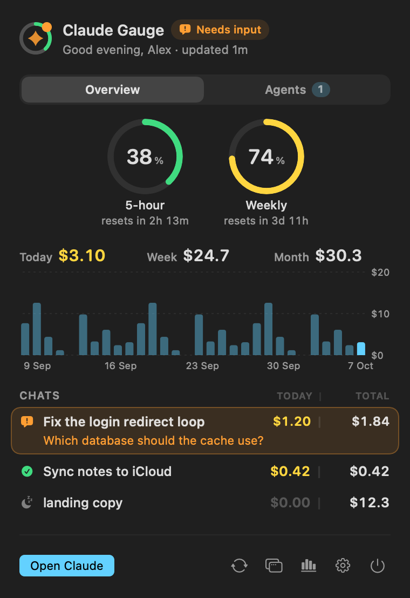

# Claude Gauge

See your Claude Code usage at a glance on your Mac: how much of your 5-hour and weekly limits is left, what each chat costs, which chats are running or waiting for you, and what your agents are doing right now.

Claude Gauge has two parts that work together:

- **The Mac app** lives in your menu bar, or as a small widget that docks to the edge of your screen. It shows your limits, spend for today, this week and this month, a 30-day chart, your chats, and running agents. It plays a sound and sends a notification when a chat needs your input or finishes. Click the notification to jump straight to that chat.
- **The Claude Code plugin** (`usage-gauge`) adds a one-line usage bar above the chat box, showing the model and effort, both limits with reset times, and this chat's and today's spend. It also tells the app what each chat is doing.

Everything stays on your Mac. The app reads files in `~/.claude`, and nothing is sent anywhere.



## Requirements

- macOS 14 (Sonoma) or later
- [Claude Code](https://claude.com/claude-code), the CLI or the Claude desktop app's Code tab, in a version that supports plugin hooks
- Xcode Command Line Tools, used to build the app from source (`xcode-select --install`)

## Install

### 1. The Mac app

```bash
git clone https://github.com/michael1271k/Claude-Gauge.git
```

```bash
cd Claude-Gauge && ./install.sh
```

This builds **Claude Gauge** into `~/Applications`, opens it, and sets it to open at login. You can turn that off in Settings. It starts in your menu bar.

### 2. The in-chat usage bar (Claude Code plugin)

In a Claude Code terminal session, run:

```
/plugin install usage-gauge --marketplace michael1271k/Claude-Gauge
```

Answer `y` to add the marketplace, then choose the **user** scope so the bar appears in every project. New chats show the bar above the input box. Chats already open pick it up after `/reload-plugins` or a restart.

## Using it

- **Menu bar or floating:** click the menu bar icon for the full panel. Click the float button to put Claude Gauge on your screen instead. It is always in one place at a time.
- **Widget:** drag it anywhere; it follows the pointer and glides into place.
  - Near the left or right edge it becomes the **edge belt**: nested rings for your limits (weekly outside, 5-hour inside) and one bead per running chat.
  - Near the bottom it becomes the **Dock shelf**, the same belt laid out horizontally.
  - Anywhere else it floats.
  - Drop it on another display and it moves there.
  - Hover the rings for limits and a pace forecast ("Weekly runs out around Sat 2:17 at this pace").
  - Hover a bead to peek at that chat: its last steps while it runs, or its question and answer choices when it needs you (picking one copies it and opens the chat).
  - Click for the full card. **Keep it open** in the toolbar holds the card open.
- **Overview tab:**
  - your limits, as rings, bars, bars with a time marker, or nested rings;
  - Today, Week and Month spend, plus a 30-day chart (hover a bar for that day);
  - your chats, each with today's and total cost.
  - Click a chat to open it in Claude.
  - Drag a row up or down to reorder.
  - Drag a row left, or right-click it, to pin or hide it.
- **Agents tab:** every running chat, with what it was asked to do, what it is doing right now, its sub-agents, and a time estimate when one is possible.
- **Prompt Pad** (note icon next to the tabs): sticky notes for prompts you want to send later.
  - **+** makes an empty note in a random color; the clipboard button makes one from what you copied.
  - Click a note to edit it in place; the copy button on its corner copies it.
  - Drag notes to reorder them.
- **Sync:** the circular-arrows button asks every open chat to re-read its usage right away.
- **Settings:** where the widget lives and on which screens; appearance themes and custom colors; the menu bar icon style; limit style; per-state sounds and notifications; and which day the week starts on.

## How spend is counted

Costs are the per-request prices Claude Code itself reports. Claude Gauge reads each chat's transcript in `~/.claude/projects` and spreads the chat's cost over the days its replies happened. Reopening an old chat never counts its cost again.

The day resets at midnight, the week on Sunday or Monday (your choice), and the month on the 1st. Totals for chats you delete later are kept in `~/.claude/gauge/ledger.json`.

## Files

| Path | What it is |
| --- | --- |
| `app/` | The SwiftUI Mac app; `app/build.sh` builds it |
| `mod/` | The Claude Code plugin (`usage-gauge`) |
| `.claude-plugin/marketplace.json` | Makes this repository installable with `/plugin install` |
| `~/.claude/gauge/` | Data the plugin and the app share at runtime (sessions, limits, totals, notes) |

## Uninstall

1. Quit Claude Gauge (power button in the panel) and delete `~/Applications/Gauge.app`.
2. Run `/plugin uninstall usage-gauge` in Claude Code.
3. Optionally delete `~/.claude/gauge`.

## Contributing

Issues and pull requests are welcome.

- After changing the app, run `./app/build.sh` to rebuild it and run its self-test.
- `./app/build.sh --snapshot <folder>` renders review images with sample data.
- For the plugin, `claude plugin validate mod` checks it.

## License

MIT. Claude Gauge is a community project and is not affiliated with or endorsed by Anthropic.
